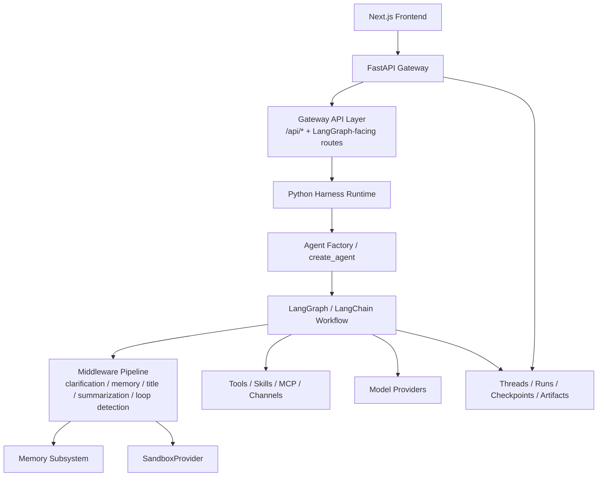
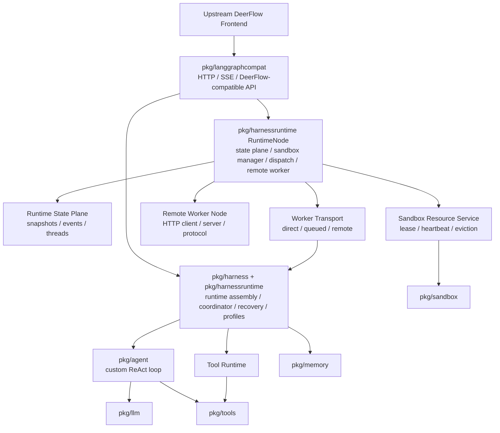

# deerflow-go

`deerflow-go` is a Go runtime that targets DeerFlow UI and LangGraph-style protocol compatibility while replacing the original Python gateway + LangGraph/LangChain harness with a self-hostable Go backend.

The goal is not a line-by-line port of upstream DeerFlow. The goal is a compatible external surface with a Go-native runtime core.

## Architecture

Upstream DeerFlow:

`deerflow-go`:

## Runtime Stack Manifest

`cmd/runtime-stack` resolves deployment topology into a portable manifest instead of shell scripts:

- `-print-manifest`: print full `stack-manifest.json` to stdout
- `-write-bundle=<dir>`: write
  - `stack-manifest.json`
  - `host-plan.json` (systemd/Electron host orchestration plan)
  - `processes/gateway.json`
  - `processes/worker.json`
  - `processes/state.json`
  - `processes/sandbox.json`
- `-bundle-restart-policy=never|on-failure|always`: set `host-plan.json` restart policy
- `-bundle-max-restarts=<n>`: set `host-plan.json` max restart count (`<=0` means unlimited)
- `-bundle-restart-delay=<duration>`: set `host-plan.json` restart delay
- `-bundle-dependency-timeout=<duration>`: set `host-plan.json` dependency readiness timeout
- `-bundle-failure-isolation`: set `host-plan.json` failure-isolation hint for host orchestrators
- `-spawn-processes`: launch the manifest as real OS processes (no `.sh`), using per-process `binary + args`
- `-process-binary-dir=<dir>`: resolve process binaries from a specific directory in external-process mode
- `-spawn-restart-policy=never|on-failure|always`: restart strategy for external-process mode
- `-spawn-max-restarts=<n>`: per-process restart limit (`<=0` means unlimited)
- `-spawn-restart-delay=<duration>`: delay before restarting a failed process
- `-spawn-dependency-timeout=<duration>`: max wait time for each dependency readiness endpoint
- `-spawn-failure-isolation`: keep other processes running when one process exits with terminal error

Each process spec includes component identity, bind address, readiness target, startup dependencies, binary, and args so orchestration can stay cross-platform (Linux/macOS/Windows/Electron-managed runtime).

## Layers

The repository is organized around six main layers:

- `cmd/langgraph`: process entrypoint and server bootstrap
- `pkg/langgraphcompat`: DeerFlow-compatible HTTP, gateway state, uploads, artifacts, threads/runs, and SSE
- `pkg/harness`: runtime assembly boundary, lifecycle/profile wiring, and agent-facing abstractions
- `pkg/harnessruntime`: runtime node, state plane, coordinator, dispatch, recovery, remote worker, sandbox manager, and bootstrap
- `pkg/agent`, `pkg/llm`, `pkg/tools`: Go-native agent loop, model adapters, and tool execution
- `pkg/memory`, `pkg/sandbox`: durable memory and execution isolation
- `TODO.md`: current architecture roadmap and remaining runtime work

Reference documents:

- [Architecture](docs/ARCHITECTURE.md)
- [API Diff](docs/API_DIFF.md)

## Remaining Large Workstreams

- Deployment split hardening:
  - keep single-node fast path
  - continue hardening gateway/worker/state/sandbox multi-process production topology
- Shared-state recovery baseline:
  - continue cross-instance recovery/join/replay coverage and operational diagnostics
  - run responses now include recovery metadata (`attempt`, `resume_from_event`, `resume_reason`, `outcome`) for debugging
- Sandbox backend completion:
  - keep `local-linux` default, continue strengthening `container`, `remote`, and `windows-restricted` backends
