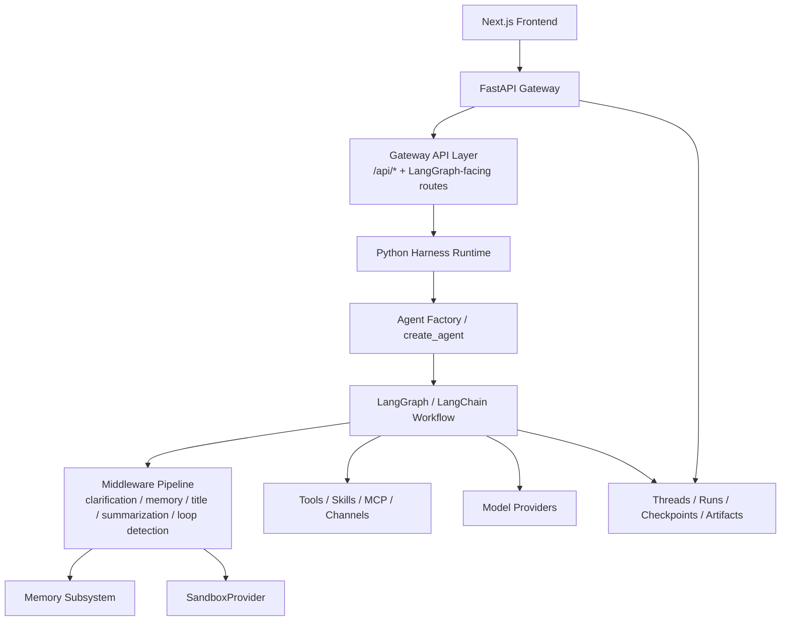
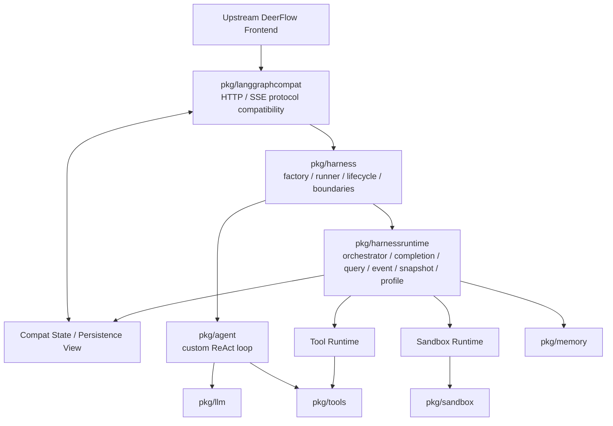

# deerflow-go

`deerflow-go` is a Go runtime that targets DeerFlow UI and LangGraph-style protocol compatibility while replacing the original Python gateway + LangGraph/LangChain harness with a self-hostable Go backend.

The goal is not a line-by-line port of upstream DeerFlow. The goal is a compatible external surface with a Go-native runtime core.

## Architecture

Upstream DeerFlow:

`deerflow-go`:

## Layers

The repository is organized around five main layers:

- `cmd/langgraph`: process entrypoint and server bootstrap
- `pkg/langgraphcompat`: DeerFlow-compatible HTTP, thread/run lifecycle, gateway state, uploads, artifacts, and SSE
- `pkg/harness`, `pkg/harnessruntime`: runtime assembly, lifecycle, profiles, orchestration, events, and snapshots
- `pkg/agent`, `pkg/llm`, `pkg/tools`: Go-native agent loop, model adapters, and tool execution
- `pkg/memory`, `pkg/sandbox`: durable memory and execution isolation

Reference documents:

- [Architecture](docs/ARCHITECTURE.md)
- [API Diff](docs/API_DIFF.md)
